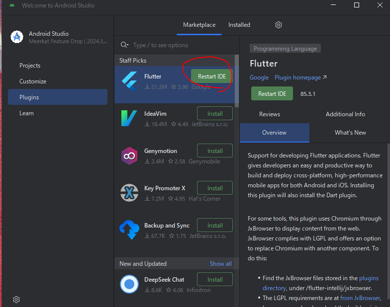

# 環境周り
## 開発環境
- Windows 11
- flutter-sdk(とりあえず最新)
- vscode
- git for windows

## flutter-sdkのインストール
下のリンク見れば大体何とかなる 
- https://qiita.com/shimizu-m1127/items/d8dfc2179bc01baaef6b

公式サイト
- https://docs.flutter.dev/get-started/install

まずは、公式サイトからzipを落とす

ダウンロードが終わったらzipファイルを自分の好きなディレクトリにおいて保管する
自分は`C:\_workspace\lib`にzipを展開して保管してる

展開したflutterの保管場所が決まったら、環境変数にパスを通す、Pathに設定すればよい

パスを通したら、VS CodeのターミナルでもPoweshell、コマンドプロンプト、なんでもいいがCLIを立ち上げる 
`flutter`だけでもいいし、`flutter --version`、`flutter doctor`等flutterを実行してみる 
今回は`flutter doctor`を試した、正常にflutterが動作することが確認できる
[x]のAndroid toolchainが用意できてないので、事項でインストールする

### Android toolchainの準備
前項で[x]マークのあったAndroid toolchainをインストールする 
公式ページ
- https://developer.android.com/studio?hl=ja

上記の公式ページに飛んで下の方に行くと、インストーラがあるので、推奨されているインストーラをダウンロードして実行

インストール出来たら、toolchainを用意する 
Android Studioを起動して（プロジェクトが開かれている時はいったんクローズ）、 
「Settings」画面が表示されるので「Languages & Frameworks」⇒「Android SDK」⇒「SDK Tools」の項目を表示します。下に表示される一覧の中に「Android SDK Command-line Tools (latest)」の項目が存在するのでチェックを入れ、右下の「Apply」をクリック。

もう一度`flutter doctor`を実行すると、[!]だったAndroid Studioが[✓]に、[x]だったAndroid toolchainが[!]になっていることがわかる。説明にあるとおり`flutter doctor --android-licenses`を実行してlicenseを受け入れないといけないので、指示通りコマンドを実行する(全部Yesでいい)

全部licenseを受け入れると以下の文言が出る

最後にもう一度`flutter doctor`を実行すると、全てが[✓]になる、これで環境準備は完了

## fvmのインストール
SDKの違うバージョンを管理できる便利な物らしい、
プロジェクトごとにSDKバージョンを切り替えられるので楽 
dartコマンドで有効か可能、`dart pub global activate fvm`、WarningでPathを通せと言われるので、環境パスに設定してあげる(C:\Users\xxxxxx\AppData\Local\Pub\Cache\bin)

`fvm --version`と打って以下のように出力ができればオッケー

`fvm releases`と打つとインストールできるflutterのバージョン一覧が出ます

今回は3.32.2をinstallしてみる。
`fvm install 3.32.2`実行すると完了する。 
ただの`flutter`と打つと自前で用意したflutterが動き`fvm flutter`と打つとfvmでインストールしたflutterが動く

## プロジェクト作成
実際にプロジェクトを作成してみる。Android Studioを起動し、「Plugin」からFlutterをInstallする。 

InstallしたらAndroid Studioを再起動し、「New Flutter Project」を選択

